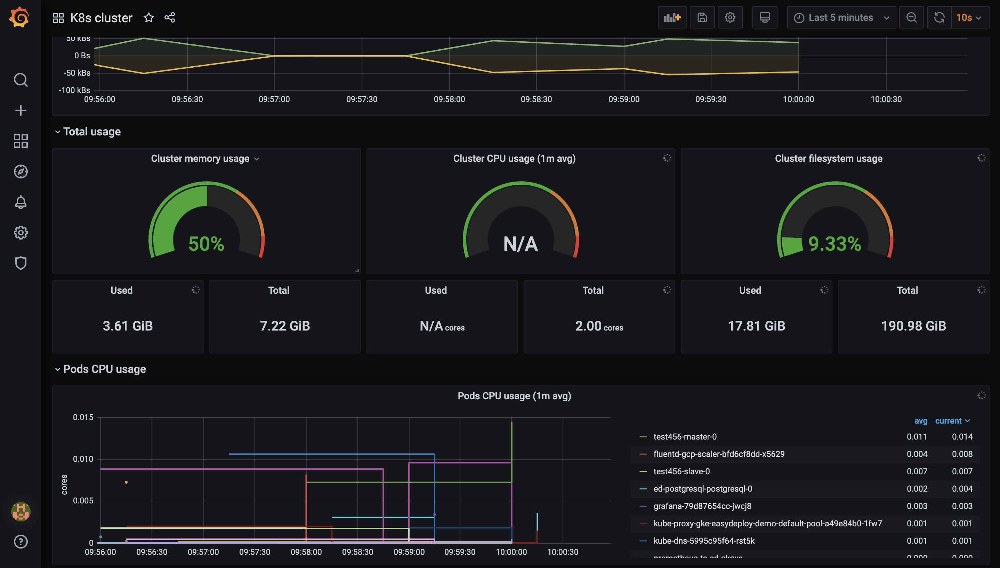
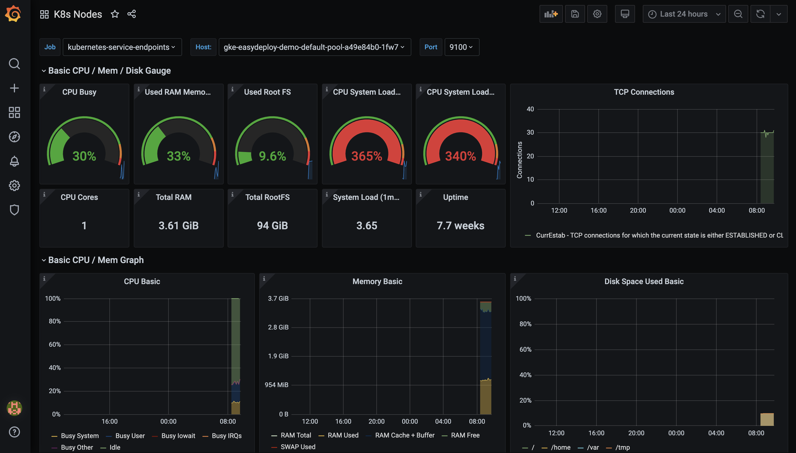
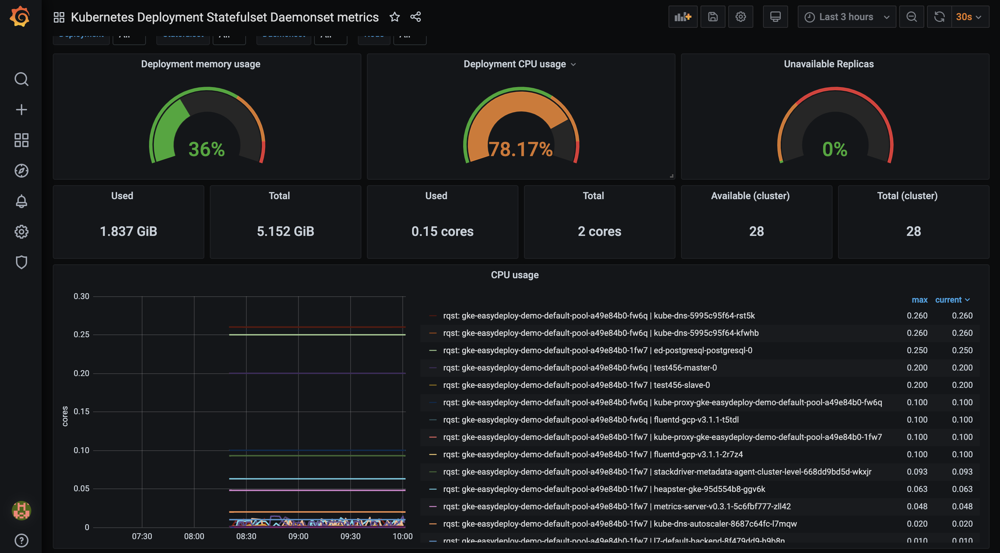

# Prometheus and Grafana on Kubernetes with custom preconfigured dashboards


Grafana supports querying Prometheus. The Grafana data source for Prometheus is included since Grafana 2.5.0. 

Prometheus is a powerful metrics collection and alerting system. Grafana is one of the best visualization tools which can be used with Prometheus. We can create a dashboard with multiple charts together in Grafana. Grafana has out-of-the-box integration with Prometheus.


## Custom Dashboards

**Dashboard for Monitor kubernetes Cluster**



**Dashboard for Monitor kubernetes worker Nodes**



**Dashboard for Monitor kubernetes Deployment, Statefulset and Daemonset**




### Ensure that you can able to get the cluster matrics with following commands.

```
kubectl get --raw /metrics
```

K8S_MAJOR=$(kubectl version -o json | jq -r .serverVersion.major)
K8S_MINOR=$(kubectl version -o json | jq -r .serverVersion.minor)
K8S_VERSION=${K8S_MAJOR}.${K8S_MINOR}


Compatibility matrix:


| Metrics Server | Metrics API group/version | Supported Kubernetes version |
| -------------- | -------------- | -------------- |
| 0.3.x | metrics.k8s.io/v1beta1 | 1.8+ |


### Metrics Server installation manifests are uploaded with GitHub release (no need now...)

They are available as `components.yaml` asset on Metrics [Server releases](https://github.com/kubernetes-sigs/metrics-server/releases) making them installable via url:

```
kubectl apply -f https://github.com/kubernetes-sigs/metrics-server/releases/download/v0.3.6/components.yaml
```

### Check helm commands

```
helm ls
```

```
helm repo add ar-grafana https://akhilrajmailbox.github.io/Prometheus-Grafana-Helm
helm search repo
```


### Install and configure prometheus on `monitor` namespace

```
kubectl create namespace monitor

helm install prometheus ar-grafana/prometheus \
    --namespace monitor \
    --set alertmanager.persistentVolume.enabled=true \
    --set server.persistentVolume.enabled=true
```


### Install and configure grafana on `monitor` namespace

**NOTE:** If you are configuring grafana on another kubernetes cluster (A dedicated cluster for monitoting the entire development),then you have to configure helm for this new k8s cluster as well, update `grafana-values.yaml` according to your conifguration and also update `securepassword` with your sensitive admin password and also update the `service.--` parts with your cloud provider configuration, this example showing the axure loadbalancer configuration

```
helm install grafana ar-grafana/grafana --namespace monitor -f Kubernetes/grafana-values.yaml
kubectl --namespace monitor get services
```

### take the password for user `admin` on grafana dashboard

```
kubectl get secret --namespace monitor grafana -o jsonpath="{.data.admin-password}" | base64 --decode ; echo
```

### To get the Public IP Address for the Grafana

### GCP
```
kubectl get svc --namespace monitor grafana -o jsonpath='{.status.loadBalancer.ingress[0].ip}' ; echo
```

*few dashboard id for kubernetes monitoring*

```
1860
1621
8588
```